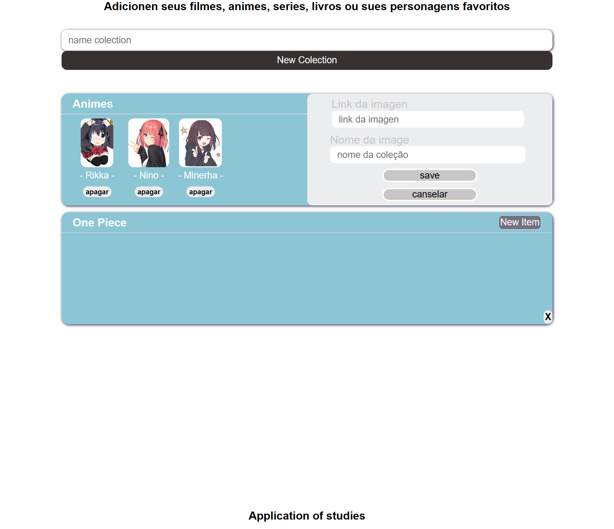

# Aplicação De Coleção

Aplicação com o intuito de permitir que o usuario monte suas coleções da maneira que desejar. utilizando imagen e dando um nome para que possa ser reconhecida

## Pro que? motivo.

A alguns messes atras, antes de começar a estudar programação. O primeiro projeto que vi sendo mentado era de cria coleção de itens favoritos. Mas as imagens eram adicionadas em quanto criava a aplicação. Agora com o conhecimento que mim foi adiquirido apos esse tempo, o refiz de uma forma diferente.

## Tecnologias Utilizada

 - Reactjs.
 - TypeScript.
 - css-module.
 - custo-hooks.
